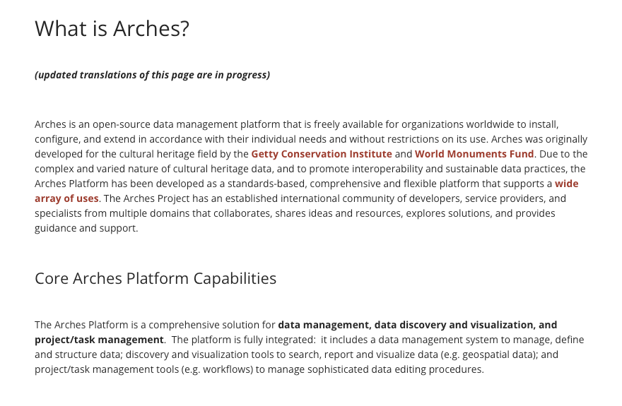
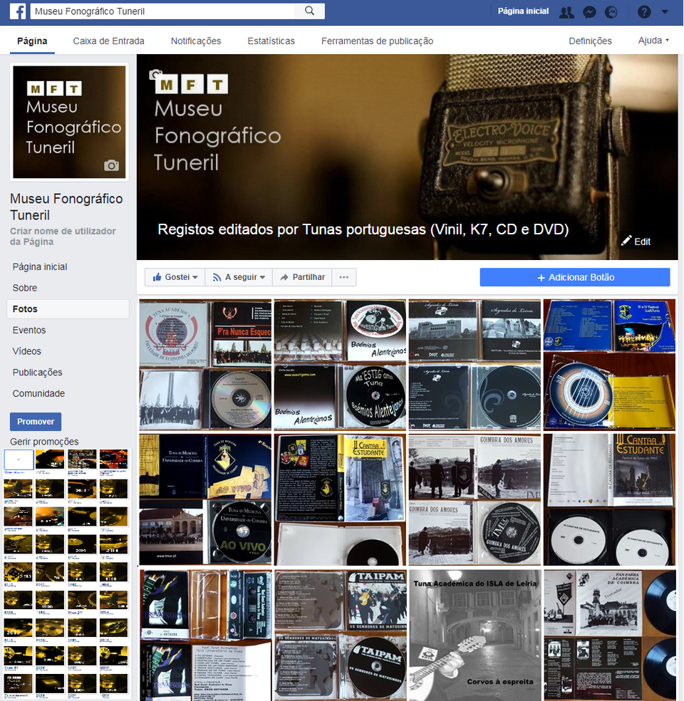

:::::::::::::::::::::::::::::::::::::: questions 

- What is Arches and why should it be used?

::::::::::::::::::::::::::::::::::::::::::::::::

::::::::::::::::::::::::::::::::::::: objectives

- Explain the benefits of using Arches.
- Explain the basics of how Arches work.

::::::::::::::::::::::::::::::::::::::::::::::::

# Introduction

Put yourself in the shoes of a collector of cards, or of antiques, of old misprinted coins, or rare one-of-a-kind stamps. Physical items of sentimental, cultural or heritage value to yourself or to society. Be it as an individual or group or an organisation dedicated to the collection and documentation of things of value, you would eventually run into the problems of scale attributed to physical collections: 

- It is unwieldy to store them, with large museums renting out massive climate-regulated warehouses to store and preserve their massive collection of delicate treasures. 

   

- It is impossible to display much, or even a majority of the collection, due to lack of space in museums proper. For instance, the National History Museum and many other museums in London only displays around 1 percent of their collection, opting to keep the rest of it in storage.

- It becomes nightmarish to sort and curate the collection. Not just identifying items for research, even choosing which artefacts go on display and which remain on the shelf becomes a problem.

This is why many museums, large and small have digital heritage collections, some open to the public like the Louvre, others for administrative and curative use. 
There are many companies offering digital solutions to digitalising museums, though the cost may be prohibitive to larger museums. 

   

Link to the museum: https://www.facebook.com/MuseuFonoTuneril/ 

A museum may instead host its own digital heritage, as such. But this way of storage may be insufficient for museums that need to store more complex information, searchable dates and links between objects to enhance the experience of browsing through the museum. This is where Arches offers a solution.

##  What is Arches and why use it?

The Arches Project was created as a collaboration between Getty Conservation Institute and World Monuments Fund as a low cost digital inventory, focusing on massive customisation and offering modern solutons to heritage research and curation.

Naturally, there are many such technologies on the market offering solutions to digitalising heritage but Arches differs from them as it is open-source. Arches has a international collaborative community passionately working to update and improve the Arches experience for all users. 

Moreover, as an open-source project, users of Arches are not beholden to any licensing fees at all. The only necessary cost of Arches is the costs to run the server. This is ideal for small museums, collectors or hobbists to digitalise collections locally or on a server for minimal cost.

In this lesson, we will follow the character of Hans, an avid collector of rare European coins, boasting over 500 unique coins in his inventory. Eying to share his love of old coins and their rich and varied histories to the world, Hans has set up an Arches installation on a server he owns and looks to design and populate his digital collection.

  

    
  

  

    
  

## Arches Permissions.

Arches allows for groups with different levels of permissions to use it. In this  course, we point out the permissions of the user and admin groups, noting also that permissions can be manually updated per installation. A large part of this course will involve end-user permissions, when more advanced functionalities are referenced, it will be done explicitly.

## Arches Functionality.

Arches is a database that can store and manage a wide assortment of datasets. Looking up and updating items stored in the database is easy as it supports keyword, type and geospatial searches. Arches also stores relational data to allow easy access to items related to each other. (i.e. All publications of a certain academic, or all persons related to a historical event.)

Arches allows for extensive customisability using a graphical database, so just about any data structure can be stored in the database. It comes with an inbuilt map search with map box as well. As such, Arches is highly flexible and can be used to store and curate a wide variety of information. We can use it to manage anything collections of librarys and museums, to individual items of interest.

Arches also implements a powerful search engine for resources in its database, allowing for customisability in search filters as well as the option to expose/hide information of a resource in a search.
(Placeholder for image of search and relations)

In this course, we will cover the following:
-Searching for Resources.
-Adding and modifying Resources.

...

We will use the Arches for HER, as well as a fresh installation of Arches.

