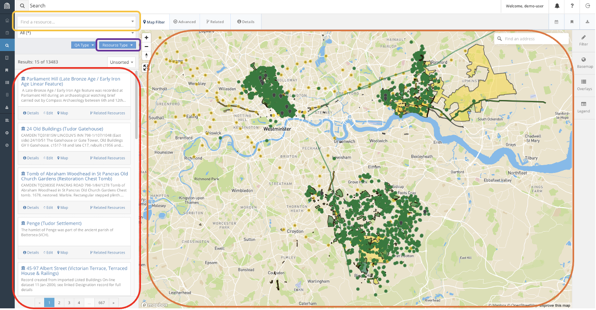
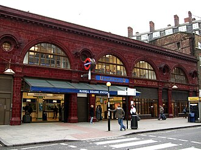
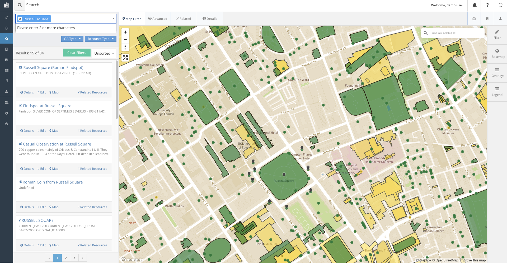
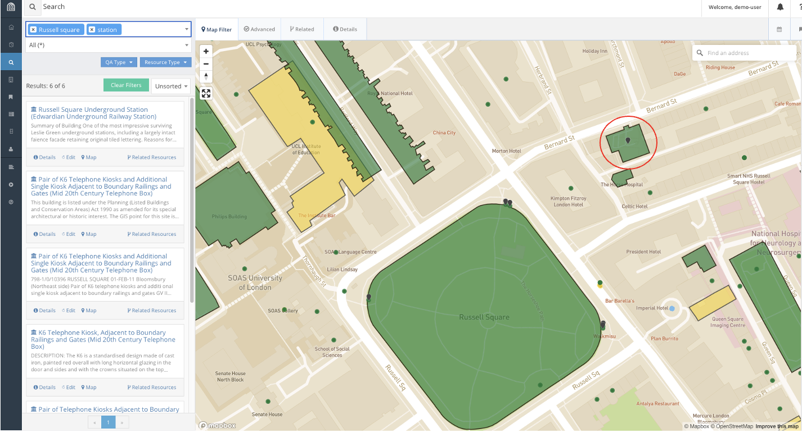
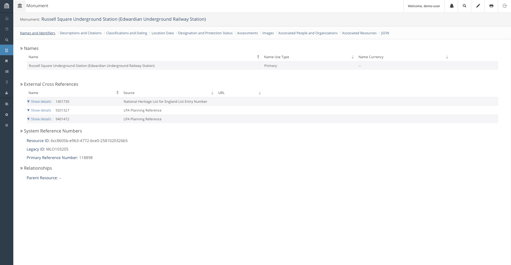
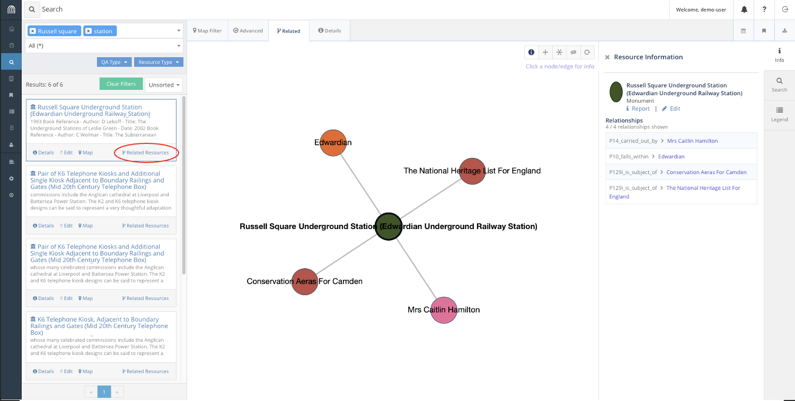
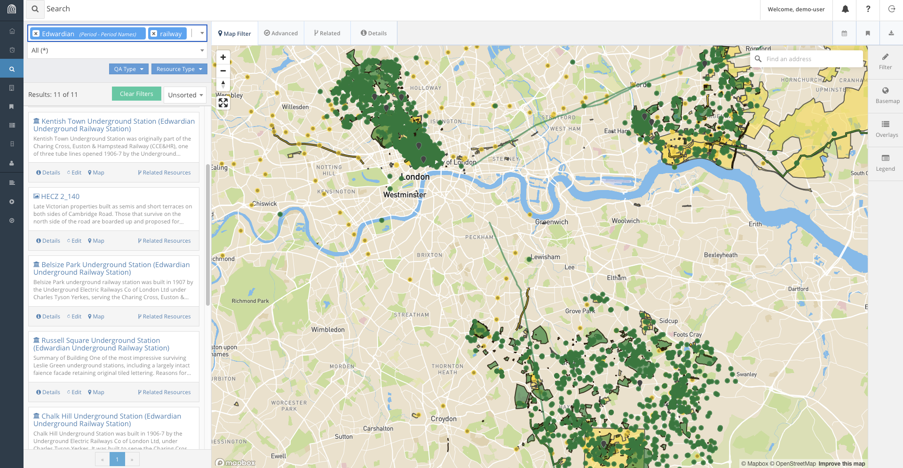

:::::::::::::::::::::::::::::::::::::: questions 

- How do you use Arches?

::::::::::::::::::::::::::::::::::::::::::::::::

::::::::::::::::::::::::::::::::::::: objectives

- Perform basic operations on available Arches Demos.
- Exercise Reading (searching for) resources on the Arches Demo.

::::::::::::::::::::::::::::::::::::::::::::::::

## Access the Arches for Heritage Demo

Before working on our own installation of Arches, Hans decides to play around with some online demo versions of Arches to get the feel of the software. Do note that changes made to the Arches demo servers are temporary and will not be reflected on subsequent visits. 

We can access an online version of Arches, Arches for HER using the following link:
https://herdemo.archesproject.org/index.htm 

   

This version is hosted online by the Arches community and is a version of Arches for Historic Environment Records, including a sample dataset from Greater London. Note that just about any part of an Arches deployment is customisable, including the home screen. 

## Find a set Resource from the Demo

There are several ways you may find and discover resources in Arches. If its name is known, we can search up its name directly. If not, we can look up the type of an object, or when it was made, or even what locations it is associated with.

Exercise:
Look up a resource by name:
On the Arches for HER Demo, click on Find on the top right.

We should navigate to the following page. 

   

This is the hub for searching for resources in Arches. In this lesson, we will use the following features to look explore resources in Arches. Using the search bar, we can find resources directly using their name and filtering on their types. We can also use the map feature to find resources if we know their geographic location.

Looking at this vast collection of resources of cultural heritage in London, Harry decides to indulge in his curiousity of Edwardian Era Trains. Supposing we want to conduct a safety audit of Train Stations constructed during the Edwardian Era, how would we use this database to find the resources we want?

For instance, say we know of such a train station: Russell Square Station. We can try to find the Resource for Russell Square Station, a historical rail station built during the Edwardian Era. 

   

We can find this resource several different ways. For instance, we can look up Russel Square on the search bar. This gets us a list of Resources related to Russel Square and zooms the map to Russel Square. 

We can look through the results list and we will likely find the result. Alternatively, we can refine our search to include the word 'station' as well.

This immediately gets us to the correct resource in the search results, Russell Square Underground Station. In fact, if we know where the station is on the map, we could also find and select it on the map.

We can now click on the Report for Russell Square Underground Station which will open a new window with the information available for the station in the database.

## Explore Related Resources

We can also look for Resources related to other resources through the Related Resource function provided by Arches. On the window we found Russell Square Underground Station, we can find a network of resources associated to the station by clicking on the Related Resources button.

Here, we find that Russell Square Station is associated with the Edwardian Era, and is listed as a Conservation Area in Camden as well as The National Heritage List for England. These links are useful to find Resources through association.

For instance, suppose we want to collate a list of all Edwardian train stations in the database, including Russell Square. We can find such a list filtering for relations to the Edwardian era in our search.

Using relations, we find four such that satisfy our conditions railway stations from the list: 

- Kentish Town
- Belsize Park
- Chalk Hill 
- Russell Square Underground Stations 

And with the right information, Harry is off for his audit!

## Challenge: Find a Resource from given parameters.

Finally, as a challenge on the current dataset, look for a Victorian era church in the Norwood area that was curiously constructed from concrete.

Category   |  Data
:-------------------------:|:-------------------------:
Era   |  Victorian
Building  |  Church
Location   |  Norwood
Percularities  |  Concrete construction

## Conclusion

Of course, there are many other ways we could try to look for these items, and that is precisely because of the existence of the expressive database stored in Arches, that allows for links between objects to be stored and retrieved. In the next episode, we will explore how the Database works.

