:::::::::::::::::::::::::::::::::::::: questions 

- How to add, modify and maintain Resources in the Arches database?

::::::::::::::::::::::::::::::::::::::::::::::::

::::::::::::::::::::::::::::::::::::: objectives

- Exercise Creating, Updating and Deleting resources on the Arches Demo.

::::::::::::::::::::::::::::::::::::::::::::::::

## Introduction

So far, we have covered how you would go about searching for information in Arches, but a database is only as good as its ability to keep itself up to date. In this lesson, we will learn to modify data on the Arches database.

Arches provides 2 ways to modify information in the database, through modifying the resource model tree directly or through workflows.

https://arches.readthedocs.io/en/latest/developing/extending/extensions/workflows/

Workflows are a streamlined way to modify the database designed to abstract away from working with Arches Resource Models themselves, which can end up being quite unwieldy. 

However, workflows may not be implemented for every necessary operation on the database so interacting with resource model trees is still necessary.

Here, we will use the Arches for Science Demo, which is a Arches instance designed to manage heritage science data: https://afsdemo.archesproject.org 

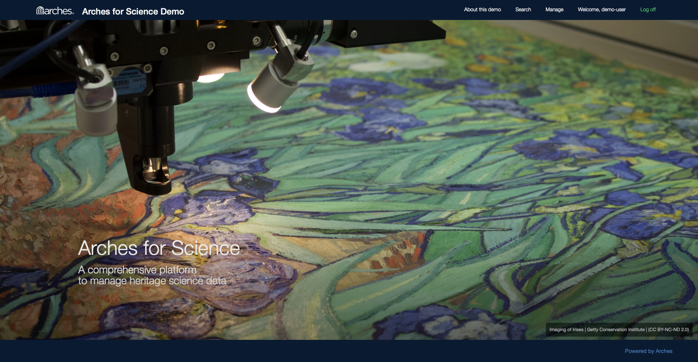

This Demo contains information about research done on heritage ceramic artefacts using the Arches for Science Resource Package.

As previously mentioned, modifications to Arches Demos are local to each session, so while we can edit the database to have a feel for the software, no one else can see our changes and they will be reset when we leave the webpage. On an actual Arches installation,  changes made to the database will be persistent.

## Using Workflow

Looking at the Arches for Science Demo, Harry decides to try to add a project into the database using Workflows. First, he searches for active projects in the database:

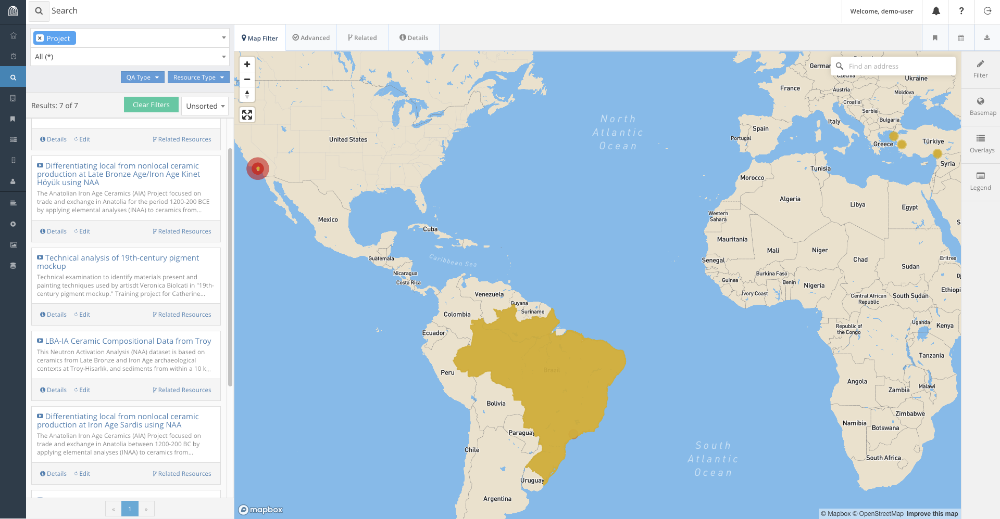

We find that projects have a name, a description, a list of physical objects involved, a start date, and a team.

Harry writes up some information for a possible project that could be added to the database:

- This project investigates the material composition of ceramics around different areas of the world to establish possible connections between pottery making methods across different communities. 
- The project is kindly funded by the International Foundation for Pottery Heritage.
- The name of the project is : Necessary Rudiments for Robust Ceramic Making Methods
- The scale of the project is : initiative
- Earliest Start Date is 11 March 2026.
- Individuals involved are Wendy Rigter, Peter Grave and Ben Marsh.
- The Pottery objects that are studied are: Sherd 782 and Sherd 1617.

In order to add the project, here's what we need to do:

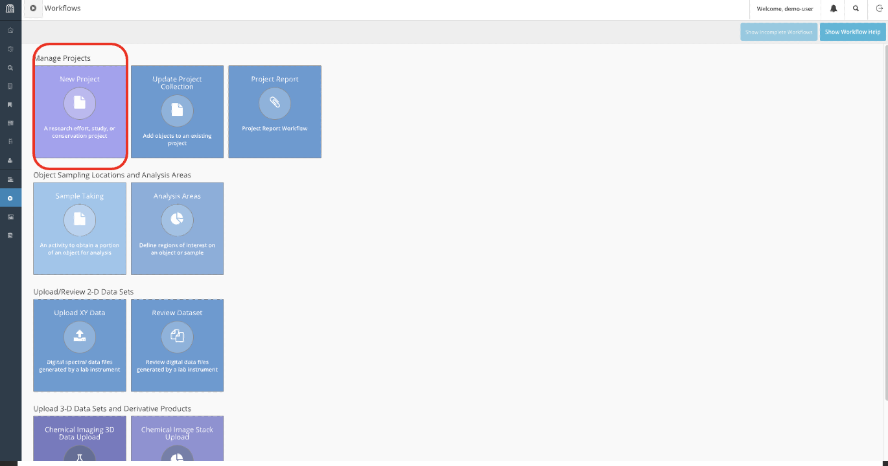

- First, navigate to the workflows tab on the sidebar and create a new project.

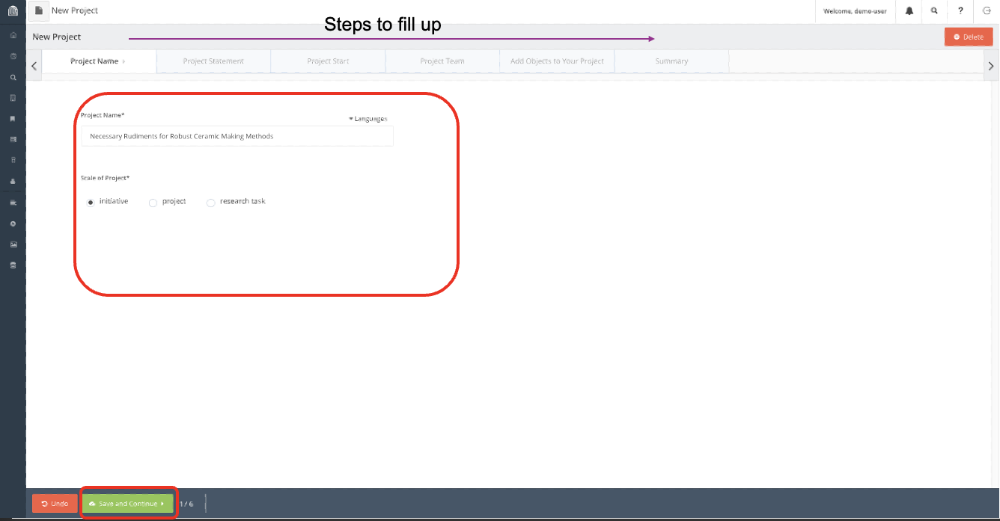

- Input the information accordingly.

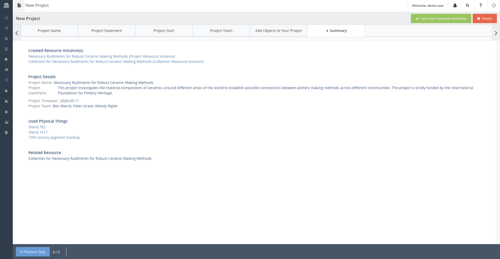

- Finally on the Summary tab, verify that all the information written is correct and complete the workflow.

Now the project is saved on the database, we can access it by search it up accordingly:

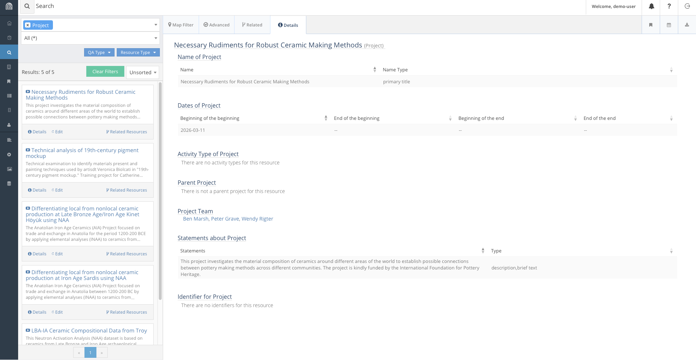

## Modifying Entries Manually

Say some time has past and we have completed our project and we want to update our database to reflect that. There is no workflow made to update the end date of a project, and it would not make much sense to do so anyway, as it ought to be a simple task. We will need to directly modify the resource to reflect this change.

Search for our project in the database and when you find it, click on the edit button on it. Navigate to the node storing start and end dates and add the end date appropriately.

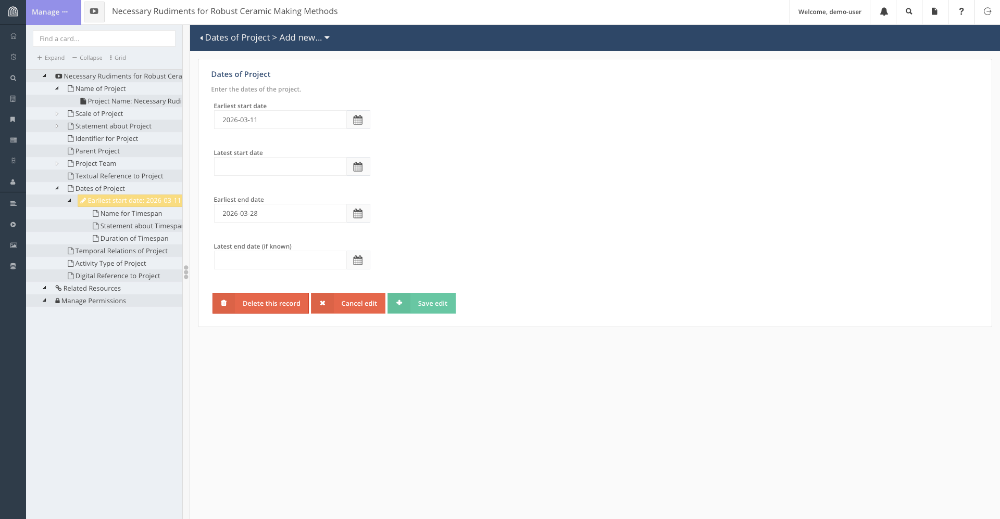

## Interacting with Location Data

In this section, we will go through another important feature of Arches: updating the map. In Arches, Resource Models may contain geospatial information. This is a reference to the location of a map. Resource Models with this attribute can be displayed on the map. 

In this section, we will go through adding a resource with geospatial information onto the database.

For instance, due to recent discoveries of Etruscan pottery scattered about Italy, we are tasked to add Italy as a major location for research onto the Arches for Science database.

This is what we would do to add Italy (or any other location) to the database:
- Create a new Place Resource.
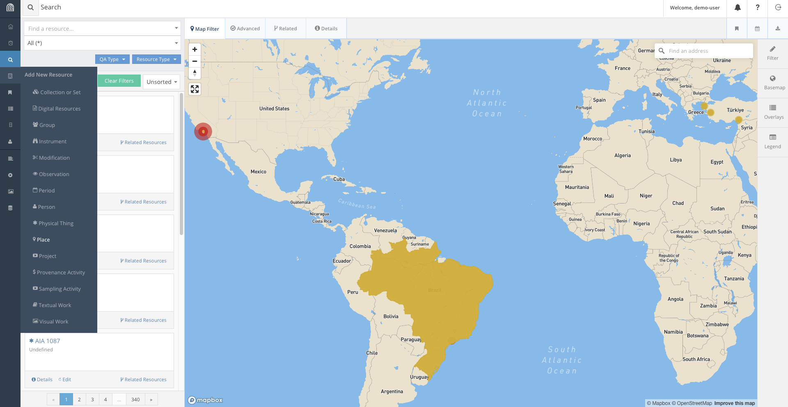
- Fill the information according to what is required.
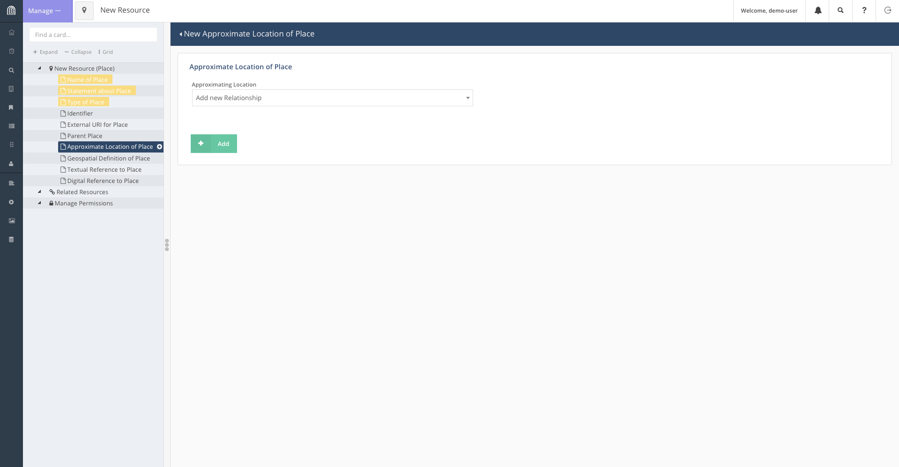
- On the page containing geospatial information, we use the tool bar to add Italy onto the map. Depending on the level of detail required, we can add either add a point on the map or box out the landmass of Italy.
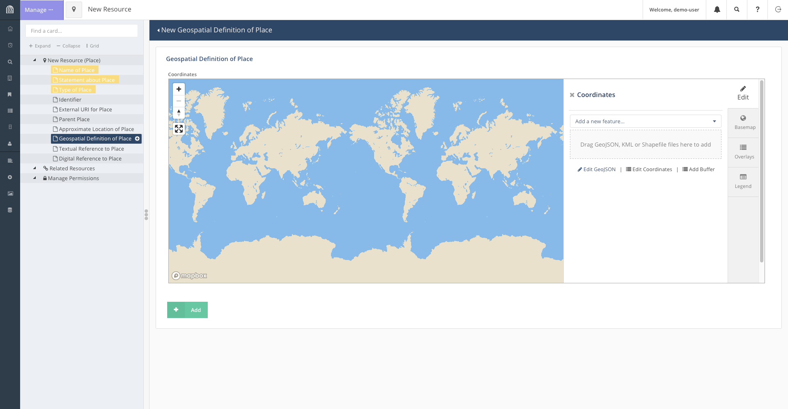
- To encircle the landmass of Italy, click on "Add a new feature" and select "Add Polygon". This will let you select points on the map to form a shape encircling Italy.
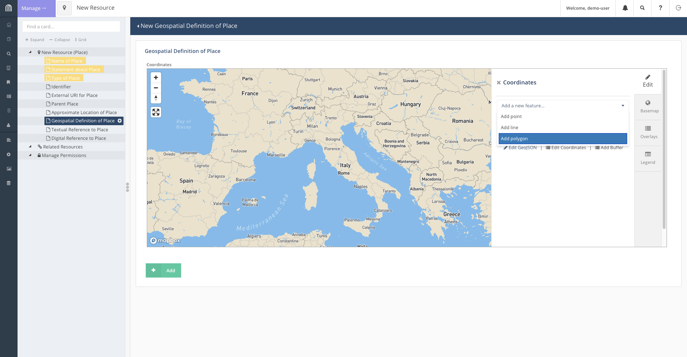
- Once the shape accurately enough encircles Italy, we save the feature and add the resource.
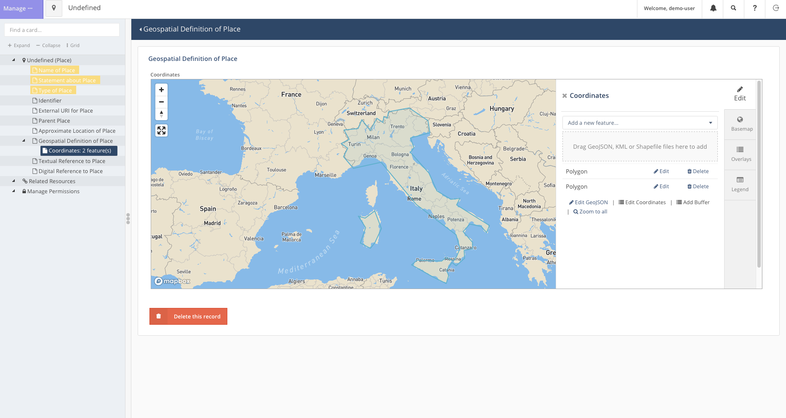

Now we can head back to the search bar and find that Italy has been added to the map.

## Deleting a Resource

As our access of the Arches for Science Demo is transient, leaving the page will revert all our changes to it. This will not be the case for our own databases. 

Regardless, deleting data is an essential part of database maintanance and Arches provides a simple way to do so as well.

For instance, if it is decided that the project, Necessary Rudiments for Robust Ceramic Making Methods, is cancelled for any reason, we may decide the best way to represent this is to remove the project from the database.

To do so:
- First, we search for the resource accordingly.
- Click on the edit button to open the popup for the resource.
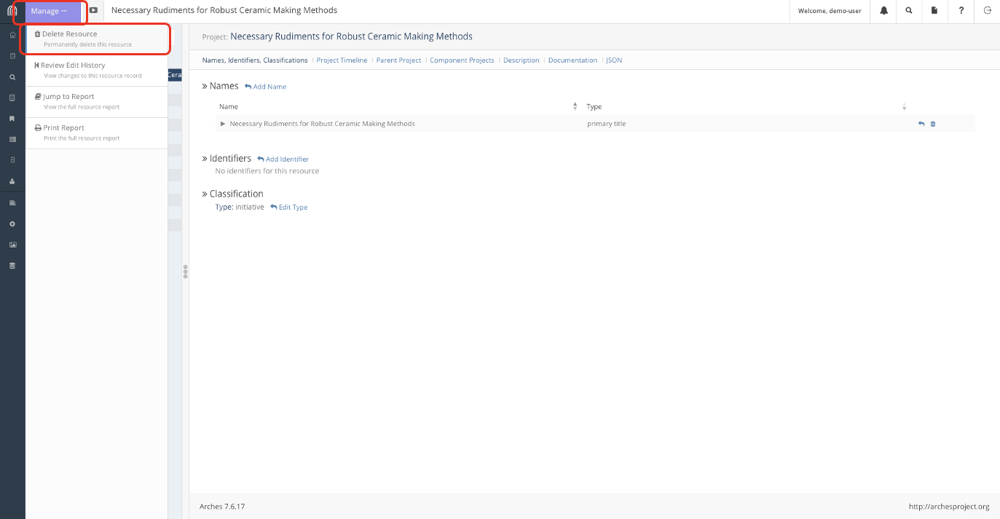

- Click on the "Manage" button on the top left to get the left tab to appear. The option to delete the resource should be the first option on the list.

## Conclusion

This process of Creating, Reading (which was done in lesson 2), Updating and Deleting (CRUD) resources is the rudiment in all database management and is essential to keeping and maintaining the Arches Database.