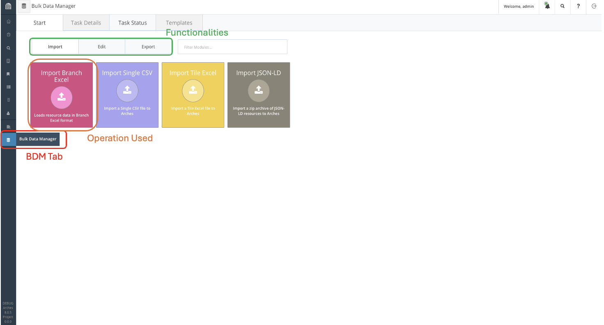
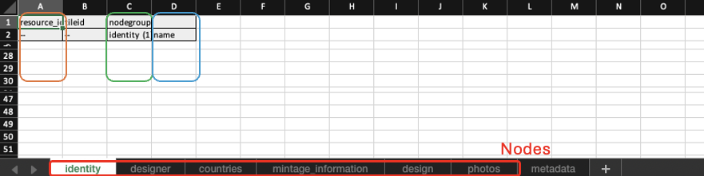
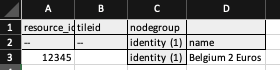
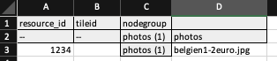

:::::::::::::::::::::::::::::::::::::: questions 

Can you automate the process of adding information to Arches?

::::::::::::::::::::::::::::::::::::::::::::::::

::::::::::::::::::::::::::::::::::::: objectives

Format and upload bulk data in Arches.

::::::::::::::::::::::::::::::::::::::::::::::::

## Bulk Data Manager (Advanced)

Harry has over 500 different coins he wants to write into the database. So far, we have only written 10. There must be a better way to write these coins into the database, especially with a repetitive task.

Arches does provide such a feature in the form of the Bulk Data Manager, though it is disabled by default. If enabled, Bulk Data Manager allows for automated uploads, edits and downloads of data of Resources en-mass.

On the server we are working on, Harry has enabled the use of Bulk Data Manager to facilitate the mass import of his coin collection. Lets try out this feature by populating the database with the dataset in the previous episode:

| Name        | Design      | Mint Date   | Mint Quantity| Face Value  | Actual Value |Designer  | Country      |
| ----------- | ----------- | ----------- | ----------- | ----------- | ----------- |----------- | ----------- |
| Belgium 2 Euros     | King Albert II and his royal monogram, the letter "A" beneath a crown       | 2004      | 10000000       | 2       | 2        | Jan Alfons Keustermans      | Belgium       |
| Croatia 50 cents      | Nikola Tesla with the Croatian checkerboard in the background.      | 2023      | 30000000       | .50       | .50 cents        |  Ivica Družak      | Croatia       |
| Croatia 1 Euro     | A marten with the Croatian checkerboard in the background.      | 2023      | 30000000       | 1       | 1        |  Stjepan Pranjković      | Croatia       |
| Croatia 5 cent      | Nikola Tesla with the Croatian checkerboard in the background.      | 2023      | 10000000       | 0.05      | 0.05        |  Maja Škripelj     | Croatia       |
| Latvia 1 Euro      | Latvian folk maide        | 2014      | 10000000       | 1      | 1       | Guntars Sietiņš       | Latvia       |
| Irish 2 Euro      | Celtic harp       | 2003      | 30000000       | 2      | 2       | Jarlath Hayes      | Ireland       |
| Irish 1 Euro      | Celtic harp       | 2003      | 30000000       | 1      | 1       | Jarlath Hayes      | Ireland       |
| Irish 50 cents      | Celtic harp       | 2003      | 10000000       | .50      | .50       | Jarlath Hayes      | Ireland       |
| Irish 5 cents      | Celtic harp       | 2003      | 5000000       | .05      | .05       | Jarlath Hayes      | Ireland       |
| Brussels Atomium Commemerative Coin      | Image of the Atomium in the center of the coin and the engraver’s initials to right with two mintmarks near the base.  | 2006      | 20000       | 2      | 20       | Luc Luycx      | Belgium       |

<a href="fig/Coins/Coin_Photos.zip" download>Click to Download Photos for the coins</a>

We can access Bulk Data Manager on the sidebar, indicated in red on the figure above. From there, navigate Import Branch Excel and download the template for Coin.

You should get the following excel spreadsheet:

Recall that this is the data structure of the Coin shown in the previous lesson, with separate sheets for each node (highlighted in red). The first column (in orange) refers to the system ID for the resource, which Arches can allocate. We can fill it as a list of unique numbers. The third column (in green) indicates the number of entries for each resource, since there is only one entry for each node, we fill this column with identity (1). The third column (in blue), contains actual information, so in the case of the name of the coin, it could be "Belgium 2 Euros" for instance.

Go down each spreadsheets and fill them up with the information provided. 
For the identity spreadsheet, an entry for the Belgium 2 Euro coin will look like this:

For the Countries tab, Arches requires the internal ID of country resources, which while we can find, we do not currently have, so we shall leave it blank and manually add it into the database later.

For the Photos tab, we write the file name of the photo on the required column and supply the photo in the same directory as the spreadsheet, which we will later compress to a zip file. Given the name of the photo for the Belgium 2 Euro coin is "belgien1-2euro.jpg", we would fill up the entry for it as such:

Once the excel spreadsheet is filled, we include it in the same directory as the photographs and compress it to a zip file. This file can then be uploaded to the Arches database through Bulk Data Manager.

Afterwards, manually link each coin to their country of mintage accordingly and the database is complete.