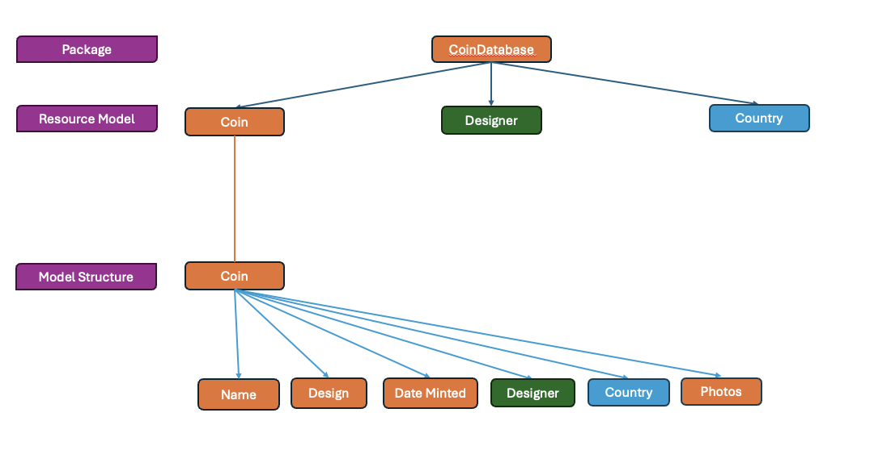

:::::::::::::::::::::::::::::::::::::: questions 

- How would the Arches installation we will work with look like

::::::::::::::::::::::::::::::::::::::::::::::::

::::::::::::::::::::::::::::::::::::: objectives

- Exercise populating an Arches Database.
- Interact with and modify persistent data written by peers.

::::::::::::::::::::::::::::::::::::::::::::::::

## Local Server

Let's go back to Harry, who after learning the Arches basics, is now ready to populate his own Arches installation. He has set up the database in episode 3 as follows:

Recap:
This means