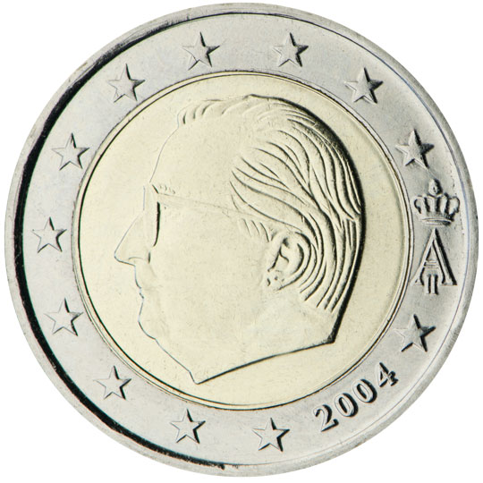
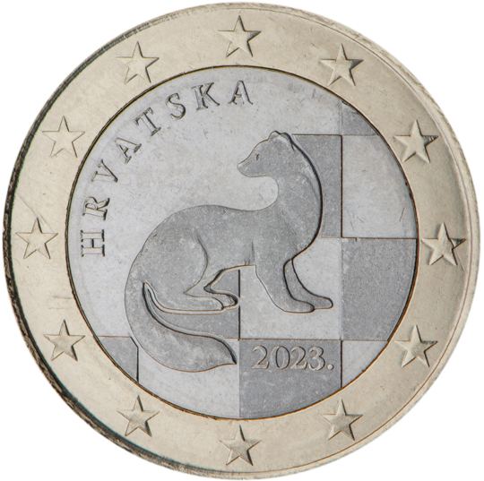
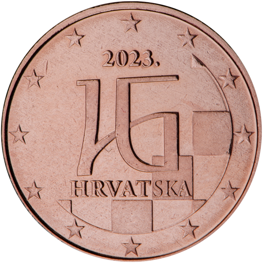
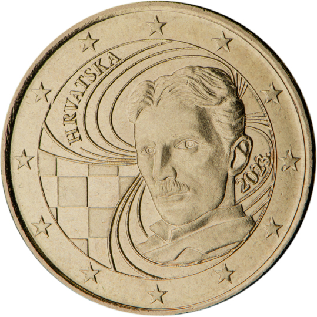
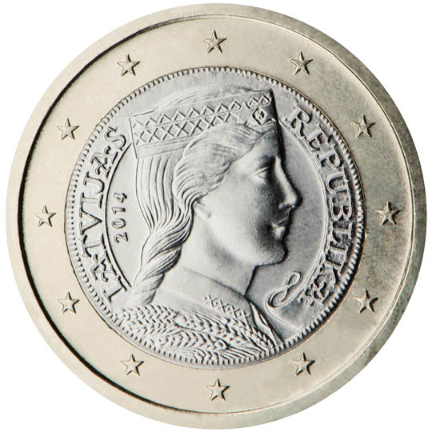
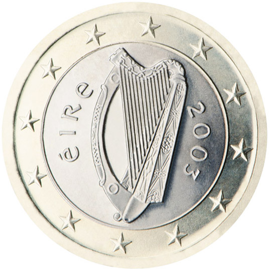
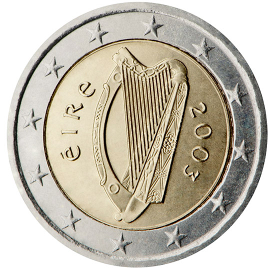
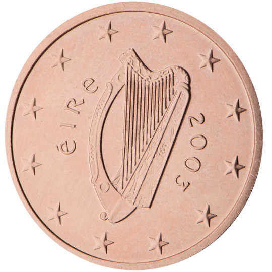
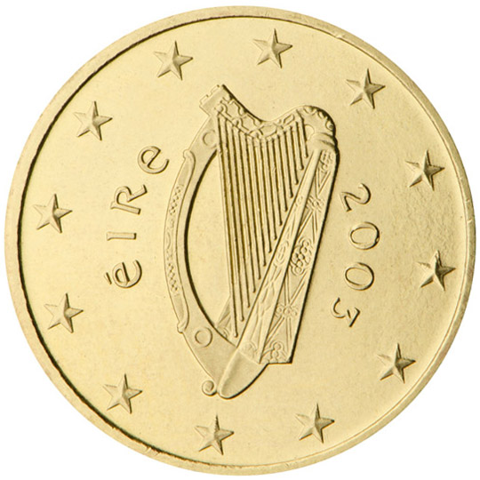
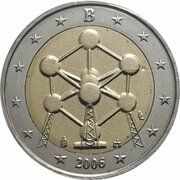

## Glossary

01-01:
https://www.archesproject.org/what-is-arches/

Arches for HERs User Guide:
https://share.articulate.com/tALq0KOGh2kA8AEUsdf65#/

Arches for HERs Demo:
https://www.archesproject.org/her-demo/

Arches for Science Demo:
https://afsdemo.archesproject.org/search?paging-filter=1&tiles=true

https://www.archesproject.org/afs-demo/

Arches Database Design:
https://arches.readthedocs.io/en/7.6/administering/designing-the-database/

Creating Relations:
https://arches.readthedocs.io/en/7.6/administering/instance-relationships/

Bulgarian Coin Reference:
https://en.numista.com/537214

## References

3D_Collections_Storage,_Minnesota_History_Center-wikicommons - 
Retrieved at https://commons.wikimedia.org/wiki/File:3D_Collections_Storage,_Minnesota_History_Center.jpg , credit: Heritage Preservation Department - MNHS, Wikimedia Commons

Museu_Fonografico_Tuneril_digital_museum_wikicommons -
Retrieved at https://commons.wikimedia.org/wiki/File:FB_do_MTF_portada.png , credit PenaWB , Wikimedia Commons

Piéce_2_euros_commémorative_wikicommons -
Retrieved at https://commons.wikimedia.org/wiki/File:Piéce_2_euros_commémorative.jpg , credit: Clementp1986, website: https://commons.wikimedia.org/wiki/User:Clementp1986 , Wikimedia Commons

Russell_Square_station_wiki_commons -
Retrieved at https://commons.wikimedia.org/wiki/File:Russell_Square_station.jpg , credit: Ewan Munro, website: https://www.flickr.com/photos/55935853@N00 , Wikimedia Commons

Smiling_cartoon_man_with_thumbs_up_using_a_computer_wikicommons - 
Retrieved at https://commons.wikimedia.org/wiki/File:Smiling_cartoon_man_with_thumbs_up_using_a_computer.jpg , credit: 0g0m019940, Wikimedia Commons

Thinking_thought_bubble.png -
Retrieved at https://commons.wikimedia.org/wiki/File:Thinking_thought_bubble.png , credit: FreyaSyauqila, Wikimedia Commons

Back_of_Bulgarian_1_euro_coin.png - 
Retrieved at https://en.wikipedia.org/wiki/File:Back_of_Bulgarian_1_euro_coin.png , credit: unknown, Wikimedia Commons

Data on coins in episodes 6 and 7, and images of coins are taken from various sources:
Source: Deutsche Bundesbank:
- 
- 
- 
- 
- 
- 
- 
- 
- 

Under Creative Commons Attribution- Non Commercial. 
Source: Numista, brismike
- 